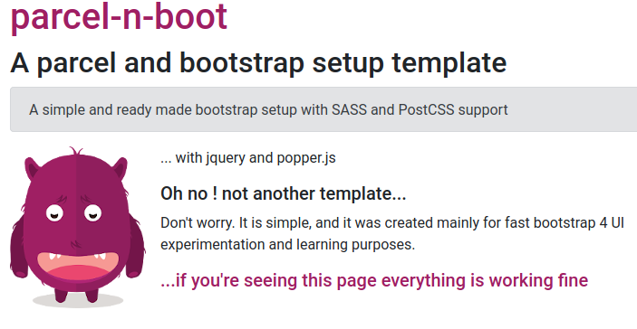

# A simple parcel and bootstrap 4 setup template

This is just a playground used mainly for tutorials and fast Bootstrap 4
UI theme creation. It includes SASS, PostCSS and autoprefixer support.
It also includes optional jquery and popper.js. All css and JS are imported
from `src/js/index.js`.

Start and run with:

```js
yarn install && yarn run start
// or
npm install && npm run start
```

Then visit `http://localhost:1234` to see if everything is working:



## Using SASS

All scss rules and utilities are imported in `src/scss/main.scss` in the way
that is recommended by the [official documentation](https://getbootstrap.com/docs/4.4/getting-started/theming)

## Updating Bootstrap version

- All sass rules are copied from `node_modules/bootstrap/scss`
  to `./src/scss/vendor/scss` for customization using [cpx](https://www.npmjs.com/package/cpx).

- When it is time to update Bootstrap version, just update it in `package.json`
  and run `yarn update` or `npm update`. The `cpx` tool will do the rest.
